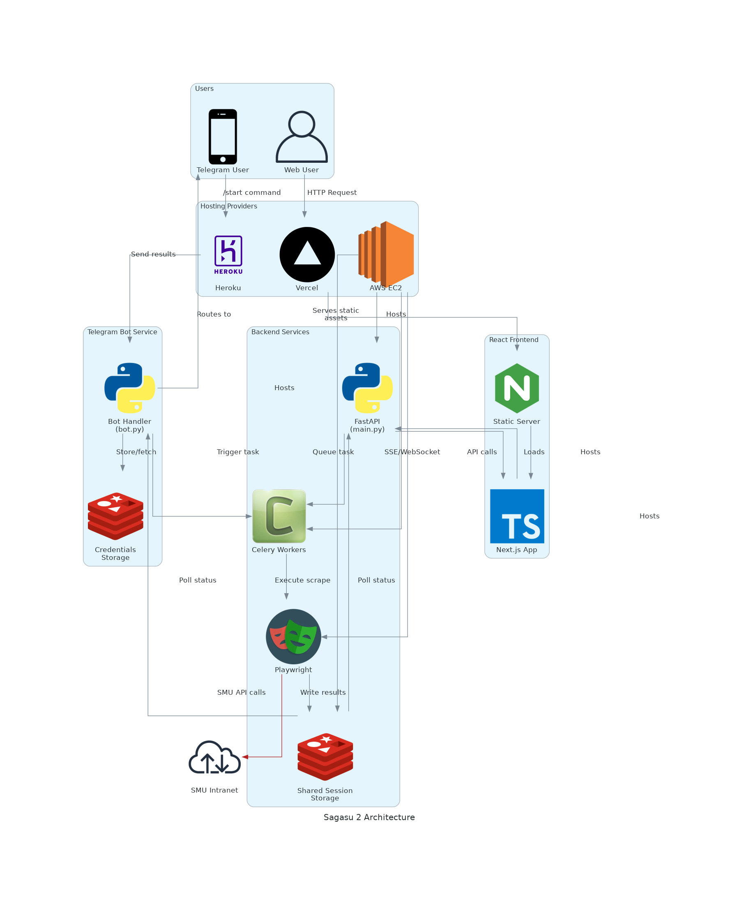

[]()
 

> [!WARNING]  
> [`Sagasu 2`](https://github.com/gongahkia/sagasu-2/tree/main?tab=readme-ov-file)'s Vercel, Heroku and AWS EC2 deployments are inactive as of 3 June 2025 due to a bug involving Microsoft Account Redirect Loops that break the scraper.
>  
> The issue is further documented here.
>  
> * [*Microsoft account redirect loop during login prevents logging in.*](https://answers.microsoft.com/en-us/msoffice/forum/all/microsoft-account-redirect-loop-during-login/834042d5-e1d4-42c8-914d-9a8299226f98)
> * [*Login redirect goes into a loop*](https://community.auth0.com/t/login-redirect-goes-into-a-loop/111254)
> * [*Redirect loop when logging into the Portal*](https://www.reddit.com/r/AZURE/comments/1czbo5z/redirect_loop_when_logging_into_the_portal/)
> * [*Login redirect loop when page url is different than the redirect url #2050*](https://github.com/AzureAD/microsoft-authentication-library-for-js/issues/2050)
> * [*Difficulty getting data from web page with login authentication*](https://community.fabric.microsoft.com/t5/Desktop/Difficulty-getting-data-from-web-page-with-login-authentication/td-p/1915017)
> * [*Infinite login loop in MS 365 and Office apps on Win 11 machine*](https://www.reddit.com/r/microsoft365/comments/1eajepp/infinite_login_loop_in_ms_365_and_office_apps_on/)
> * [*Stuck in an infinite loop of needing to already be signed in to the Authenticator app to approve a sign in FOR the authenticator app.*](https://answers.microsoft.com/en-us/msteams/forum/all/stuck-in-an-infinite-loop-of-needing-to-already-be/ad37ec67-5a04-4e83-acc2-a3c9b8a9817b)

# `Sagasu 2`

<p align="center">
    
</p>

`Sagasu 2` is served in the following forms through a unified [FastAPI](https://fastapi.tiangolo.com/) interface.

1. ***Live Telegram Bot*** [@sagasu2_bot](https://t.me/sagasu2_bot)
2. ***Live Web App*** at [sagasu-two.vercel.app](https://sagasu-two.vercel.app/)

## Rationale

[SMU's Facility Booking System](https://fbs.intranet.smu.edu.sg/home) isn't an inherently slow website. Booking facilities in itself is quick.  
  
However, the bloated UI and overly convaluted journey users must navigate through to search for available rooms gives off a sluggish impression.
  
`Sagasu 2` *(the sequel to [`Sagasu`](https://github.com/gongahkia/sagasu/))* is a Telegram Bot and Web App that scrapes SMU FBS per user-specified filters for available rooms, flagging any vacant facilities so users can quickly secure them on FBS.

## Stack

* *Frontend*: [Telegram Bot API](https://core.telegram.org/), [React](https://react.dev/), [Next.js](https://nextjs.org/), [Vercel](https://vercel.com/)
* *Backend*: [Python](https://www.python.org/), [FastAPI](https://fastapi.tiangolo.com/), [Heroku](https://www.heroku.com/), [AWS EC2](https://aws.amazon.com/ec2/)
* *Cache*: [Redis](https://redis.io/)
* *Package*: [Docker](https://www.docker.com/)
* *Scraper*: [Playwright](https://github.com/microsoft/playwright)
* *Distributed Task Scheduling*: [Celery](https://docs.celeryq.dev/en/stable/)

## Architecture

Note the below diagram shows the [Telegram Bot](./telegram_bot/), [Web App](./web/frontend/) and [FastAPI Server](./web/backend/).



## Usage

Note the most direct way to use `Sagasu 2` would be to [**use the Telegram Bot/Web App**](#sagasu-2).

The below instructions are for locally running `Sagasu 2`. 

1. First run the below.

```console
$ python3 -m venv myenv
$ source myenv/bin/activate
$ make
```

2. Then create a `.env` file with the following details at `./`.

```env
TELEGRAM_BOT_TOKEN=XXX
SMU_FBS_USERNAME=XXX
SMU_FBS_PASSWORD=XXX
SSL_KEY_PATH=XXX
SSL_CERT_PATH=XXX
API_KEYS=XXX,YYY,ZZZ
REDIS_URL=redis://localhost:6379/0
ENV=development
```

3. Then run the below.

```console
$ docker-compose up redis core
$ docker-compose up telegram-bot
$ docker-compose up web-backend
$ cd web/frontend && npm start
```

## Other notes

[`Sagasu-2`](https://github.com/gongahkia/sagasu-2) stands on the shoulders of [`Sagasu`](https://github.com/gongahkia/sagasu).